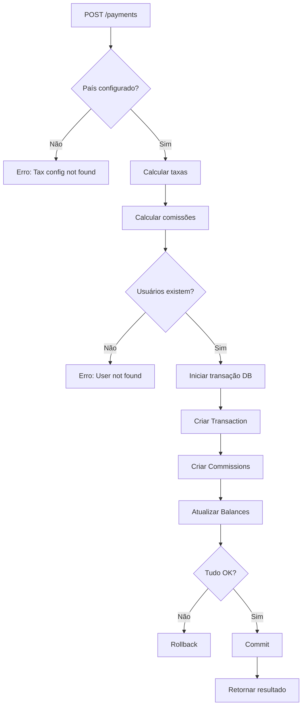

# Regras de Negócio - Sistema de Pagamentos

## 1. Processamento de Vendas

### 1.1 Fluxo de Pagamento
```
Valor Bruto → (-) Taxas → Valor Líquido → (-) Comissões → Saldos
```

### 1.2 Cálculo de Taxas
- **Taxa variável**: Percentual baseado no país (`taxConfig.rate`)
- **Taxa fixa**: Valor fixo por transação (`taxConfig.fixedFee`)
- **Fórmula**: `taxAmount = (amount × rate) + fixedFee`
- **Valor líquido**: `netAmount = amount - taxAmount`

### 1.3 Distribuição de Comissões (baseado no valor líquido)

| Participante | Percentual | Condição |
|-------------|-----------|----------|
| Plataforma  | 5%        | Sempre aplicado |
| Afiliado    | 10%       | Se `affiliateId` informado |
| Coprodutor  | 15%       | Se `coproducerId` informado |
| Produtor    | Restante  | Recebe o que sobra após descontos |

**Exemplo com todos os participantes:**
```
Valor líquido: R$ 100,00
- Plataforma: R$ 5,00 (5%)
- Afiliado: R$ 10,00 (10% de 100)
- Coprodutor: R$ 15,00 (15% de 100)
- Produtor: R$ 70,00 (100 - 5 - 10 - 15)
```

### 1.4 Atomicidade das Transações
- Todo processamento ocorre em **transação de banco de dados**
- Garante que:
  - Transaction é criada
  - Commissions são registradas
  - Balances são atualizados
  - Se qualquer operação falhar, tudo é revertido

## 2. Sistema de Taxas

### 2.1 Configuração por País
- Cada país pode ter sua própria configuração
- Campos obrigatórios:
  - `country`: Código ISO do país (ex: BR, US)
  - `rate`: Taxa percentual (Decimal)
  - `fixedFee`: Taxa fixa opcional (Decimal, padrão: 0)

### 2.2 Países Pré-configurados
- **BR (Brasil)**: 
  - Rate: 0.065 (6.5%)
  - Fixed Fee: 0.39 (R$ 0,39)
- **US (Estados Unidos)**:
  - Rate: 0.029 (2.9%)
  - Fixed Fee: 0.30 (US$ 0,30)

### 2.3 Regras de Validação
- País deve existir na configuração antes do processamento
- Taxa não pode ser negativa
- Apenas usuários PLATFORM podem criar/editar configurações

## 3. Sistema de Saldos

### 3.1 Atualização de Saldos
- Cada usuário tem um único registro de saldo (`Balance`)
- Saldo é incrementado automaticamente ao processar venda
- Operação é atômica junto com a criação da transação

### 3.2 Rastreabilidade
- Cada atualização de saldo tem uma `Commission` correspondente
- Permite auditoria completa do fluxo de dinheiro
- Histórico de comissões disponível por usuário

## 4. Controle de Acesso (RBAC)

### 4.1 Papéis de Usuário
- **PRODUCER**: Vendedor principal do produto
- **AFFILIATE**: Divulgador que recebe comissão
- **COPRODUCER**: Parceiro na produção
- **PLATFORM**: Administrador da plataforma

### 4.2 Permissões por Papel

| Endpoint | PRODUCER | AFFILIATE | COPRODUCER | PLATFORM |
|----------|----------|-----------|------------|----------|
| POST /auth/register | ✅ | ✅ | ✅ | ✅ |
| POST /auth/login | ✅ | ✅ | ✅ | ✅ |
| GET /auth/profile | ✅ | ✅ | ✅ | ✅ |
| GET /users | ❌ | ❌ | ❌ | ✅ |
| GET /users/:id | ❌ | ❌ | ❌ | ✅ |
| GET /balances | ❌ | ❌ | ❌ | ✅ |
| GET /balances/me | ✅ | ✅ | ✅ | ✅ |
| GET /balances/user/:id | ✅ | ✅ | ✅ | ✅ |
| POST /payments | ✅ | ✅ | ✅ | ✅ |
| GET /taxes | ✅ | ✅ | ✅ | ✅ |
| POST /taxes | ❌ | ❌ | ❌ | ✅ |
| PUT /taxes/:id | ❌ | ❌ | ❌ | ✅ |
| DELETE /taxes/:id | ❌ | ❌ | ❌ | ✅ |

## 5. Segurança

### 5.1 Autenticação
- JWT com expiração de 7 dias
- Senhas hasheadas com bcrypt (10 rounds)
- Token obrigatório para endpoints protegidos

### 5.2 Validação de Dados
- Todos os DTOs validados com class-validator
- Valores monetários sempre Decimal no banco
- Conversão para Number apenas na apresentação

### 5.3 Dados Sensíveis
- **NÃO armazenamos**:
  - Números de cartão
  - CVV
  - Dados completos de pagamento
- **Armazenamos com segurança**:
  - Senhas (hash bcrypt)
  - Valores de transações (apenas totais)
  - Saldos de usuários

## 6. Validações de Negócio

### 6.1 Processamento de Venda
✅ País deve existir na configuração de taxas
✅ Produtor deve existir e ter saldo
✅ Afiliado (se informado) deve existir
✅ Coprodutor (se informado) deve existir
✅ Valor deve ser positivo
✅ Plataforma deve ter usuário cadastrado

### 6.2 Consistência de Dados
✅ Transação só é salva se todos os saldos forem atualizados
✅ Comissões sempre somam exatamente o valor líquido
✅ Cada comissão tem um tipo correspondente ao papel do usuário

## 7. Fluxo Completo de Venda



## 8. Exemplo Prático

### Cenário: Venda de R$ 100,00 no Brasil

**Entrada:**
```json
{
  "amount": 100.00,
  "country": "BR",
  "producerId": "uuid-producer",
  "affiliateId": "uuid-affiliate",
  "coproducerId": "uuid-coproducer"
}
```

**Processamento:**

1. **Taxas (Brasil: 6.5% + R$ 0.39)**
   - Taxa variável: 100 × 0.065 = R$ 6.50
   - Taxa fixa: R$ 0.39
   - Total taxas: R$ 6.89
   - Valor líquido: 100 - 6.89 = **R$ 93.11**

2. **Comissões (sobre R$ 93.11)**
   - Plataforma (5%): R$ 4.66
   - Afiliado (10%): R$ 9.31
   - Coprodutor (15%): R$ 13.97
   - Produtor (restante): 93.11 - 4.66 - 9.31 - 13.97 = **R$ 65.17**

3. **Atualização de Saldos**
   - ✅ Balance do Produtor: +R$ 65.17
   - ✅ Balance do Afiliado: +R$ 9.31
   - ✅ Balance do Coprodutor: +R$ 13.97
   - ✅ Balance da Plataforma: +R$ 4.66

**Saída:**
```json
{
  "transactionId": "uuid-transaction",
  "grossAmount": 100.00,
  "taxAmount": 6.89,
  "netAmount": 93.11,
  "commissions": [
    { "type": "PRODUCER", "amount": 65.17 },
    { "type": "PLATFORM", "amount": 4.66 },
    { "type": "AFFILIATE", "amount": 9.31 },
    { "type": "COPRODUCER", "amount": 13.97 }
  ]
}
```

## 9. Melhorias Futuras Sugeridas

- [ ] Comissões configuráveis por produto/usuário
- [ ] Histórico de transações por período
- [ ] Relatórios de comissões agregados
- [ ] Sistema de retirada de saldo
- [ ] Webhooks para notificações
- [ ] Rate limiting por usuário
- [ ] Logs estruturados de auditoria
